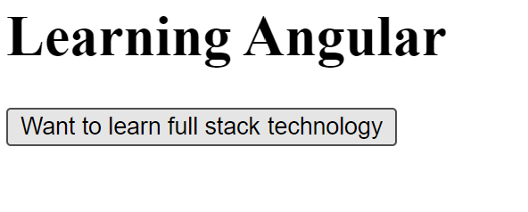

# Java script

### Toggle Heading

Below program toggles the heading text from "Learning Angular" to "Learning JS" and vice versa.

```js
<html>
    <body>
        <h1 id="header">Learning JS</h1>
        <button id="btn">Want to learn full stack technology</button>
        <script>
            document.getElementById("btn").onclick = function() {
                document.getElementById("header").textContent = 
                    document.getElementById("header").textContent === "Learning JS"
                        ? "Learning Angular"
                        : "Learning JS";
            };
        </script>
    </body>
</html>
```



*Fig: Toggle text in heading*

### Toggle Image

Below programs allows you to change the image.

```js
<html>
    <body>
         
        <button id="one">Rockstar player</button>
        <button id="two">Flying Ghost</button>

        <script>
            const btn1 = document.getElementById('one');
            const btn2 = document.getElementById('two');
            const image = document.getElementById('image1');

            btn1.onclick = function() {
                image.src = "https://th.bing.com/th/id/OIP.VaJ4UxP-AxseaKajBEgrLgHaEo?w=298&h=186&c=7&r=0&o=5&dpr=2&pid=1.7";
            };
            btn2.onclick = function() {
                image.src = "https://th.bing.com/th/id/OIP.v6C6YCRUTmFeL8vbI44FogHaEK?w=297&h=180&c=7&r=0&o=5&dpr=2&pid=1.7";
            };
        </script>
    </body>
</html>
```


*Fig: Toggle image*