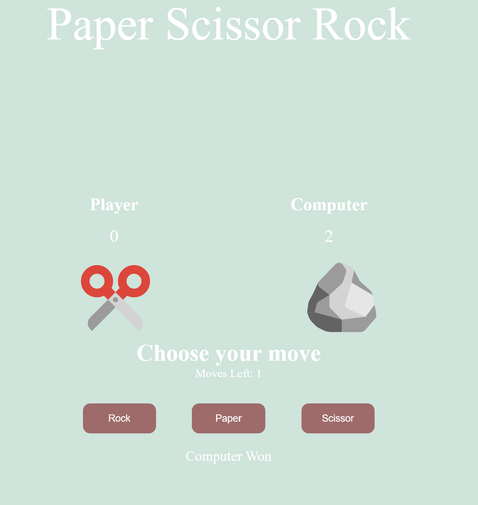
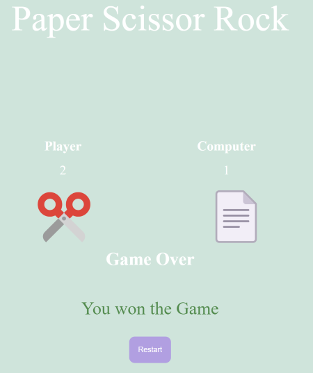

# Paper Scissor Rock Game 🎳

This is a simple Rock paper scissor game, created using HTML, CSS AND JS.

In this player can choose one of the 3 options and computer will choose randomly (no cheating). The rules are same as in real game. 🏓

- Scissor beats paper.
- Paper beats rock.
- Rock beats scissor.

## Features 🪶

1. There are 3 buttons for 3 options.
2. The chosen action and result of each game is shown.
3. After 3 games, final result is shown. 

# Result ⛵

*Fig: Playing the Game*

Result after 3 games.

*Fig: Best of 3 is considered*