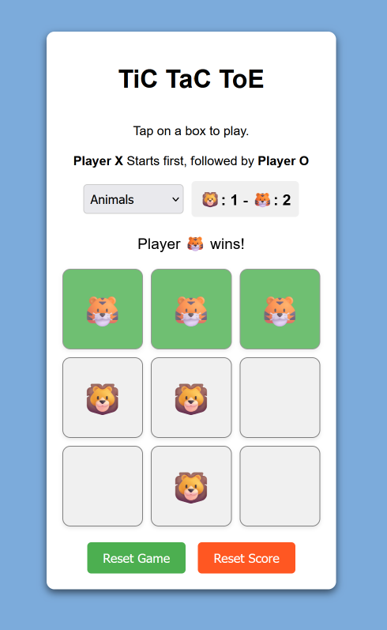
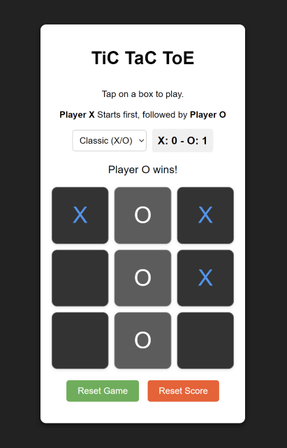

# Tic Tac Toe Game

Today, I decided to create a Tic-Tac-Toe game using HTML, CSS and JS. I have added some cool things as mentioned below.

You can play the game on this [link](https://ds-meena.github.io/Learn-HTML-CSS-JS/Learning-JS/Tic-Tac-Toe-Game/) 🎮. Try with your friends and family.

## Features

- First of all, it's simple and Beautiful design.
- **Winner cell** highlighting in green colour.
- **Multiple themes** to play with including Classic (X/O), Animal (🦁/🐯) and Shapes (★/◆).
- **Score card display** - for you to decide best of 3, best of 5 or anything else.
- `Reset game` or `Reset score` buttons 🔘.
- **Dark mode** support 🌚.

# Results

The game looks beautiful. Take a look 🐯.

This game also has Dark mode capability. If you run on a browser that prefers dark mode, then it will look like this:

*Fig: Tic tac toe in Dark mode*
